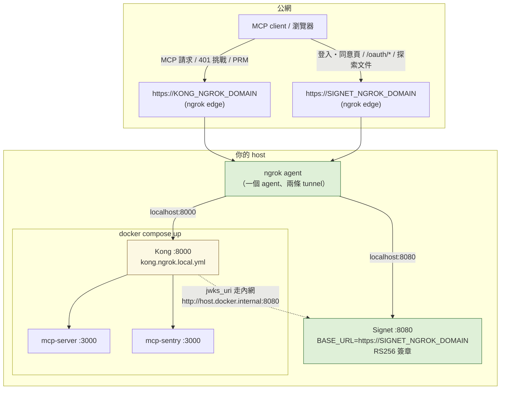

# kong-mcp-oauth2 ngrok 公網示範教學（host Signet + 兩條 tunnel）

這份教學帶你把本 repo 的 demo 環境透過 **[ngrok](https://ngrok.com)** 直接開到
公網：遠端 MCP client（MCP Inspector、claude.ai custom connector）連到
`https://<你的網域>/mcp/server`，完整走完 OAuth 握手並呼叫工具。

與 [HANDS-ON.zh-TW.md](HANDS-ON.zh-TW.md)（全 localhost）的差別只有一個：
**兩個入口都是公網 HTTPS 網域**。Kong 與兩個 demo MCP server 照舊跑在
`docker compose` 裡；**Signet 由你自己架在 host 的 `localhost:8080`**（跟
HANDS-ON 相同的前提），再由一個 ngrok agent 同時開兩條 tunnel 把兩者送上公網。

> 產品說明與設定欄位請看 [README.zh-TW.md](README.zh-TW.md)；本機驗證與除錯
> 技巧（JWKS probe、header 防偽測試等）請看 [HANDS-ON.zh-TW.md](HANDS-ON.zh-TW.md)，
> 這裡不重複。矩陣列的實際輸出（401/403/200 各列）都在本 repo 的 Kong +
> plugin 上實測過；Signet 端步驟以 AuthGate `0.36.0` 的介面為準。

---

## 1. 目標與架構



三個 URL 各自的角色（與 HANDS-ON §4 同一個雷，只是換成公網）：

| plugin 欄位      | 值                                                       | 為什麼                                                                   |
| ---------------- | -------------------------------------------------------- | ------------------------------------------------------------------------ |
| `issuer`         | `https://SIGNET_NGROK_DOMAIN`                            | 與 token 的 `iss` **逐字元比對**；Signet 的 `iss` 來自它的 `BASE_URL`    |
| `gateway_origin` | `https://KONG_NGROK_DOMAIN`                              | 組 PRM `resource` 與預期 `aud`（`gateway_origin + resource_path`）       |
| `jwks_uri`       | `http://host.docker.internal:8080/.well-known/jwks.json` | 由 **Kong 容器**抓取——直連 host 的 Signet，不繞公網 edge（快、不吃流量） |

> **免費方案的取捨**：免費 ngrok 帳號只送 **1 個 static domain**，本教學把它
> 給 **Kong**（這是 client 要輸入、要登記進 `allowed_resources` 的 URL，最不
> 想變動）；Signet 那條用隨機網域。代價是 **agent 重啟後 Signet 網域會換**，
> 要重跑 §4 的 sed 並改 `BASE_URL` 重啟 Signet——所以 demo 期間讓 agent 一直
> 開著。付費方案可以直接領兩個 static domain，此問題消失。

---

## 2. 前置需求

| 工具                   | 確認指令                                                            | 備註                                                                       |
| ---------------------- | ------------------------------------------------------------------- | -------------------------------------------------------------------------- |
| Docker + Compose       | `docker compose version`                                            | Docker Desktop、colima、OrbStack 皆可                                      |
| ngrok CLI v3           | `ngrok version`                                                     | `brew install ngrok` 或到 [ngrok.com/download](https://ngrok.com/download) |
| ngrok 帳號 + authtoken | [dashboard](https://dashboard.ngrok.com/get-started/your-authtoken) | 免費即可                                                                   |
| 1 個免費 static domain | [dashboard → Domains](https://dashboard.ngrok.com/domains)          | 形如 `xxx.ngrok-free.app`，下文以 `KONG_NGROK_DOMAIN` 代稱                 |
| **一個能跑的 Signet**  | `curl -s http://localhost:8080/.well-known/openid-configuration`    | 跟 HANDS-ON §0 相同前提：Signet 跑在 host 的 `:8080`                       |
| curl / openssl / jq    | 內建 / `brew install jq`                                            | 驗證用                                                                     |

> **colima 使用者**：`jwks_uri` 用的 `host.docker.internal` 已由
> [`docker-compose.yml`](docker-compose.yml) 的
> `extra_hosts: host.docker.internal:host-gateway` 補上，不用改。

---

## 3. Signet 端：RS256 金鑰與公網 BASE_URL

### 3a. 為什麼必須 RS256

plugin **只透過 JWKS 驗章**（演算法 pin 在 RS 家族）。Signet 預設的 HS256 是
對稱簽章、沒有公鑰可發佈，JWKS 端點會是空的——所有 token 一律驗不過。所以
Signet 必須改用非對稱簽章（呼應 README「Signet 端動手前確認」第 2 點）：

```bash
# 在 Signet 的執行目錄產生 RSA 私鑰（2048 bits 起）
openssl genrsa -out signet-rs256.pem 2048
```

### 3b. Signet 環境變數

在 Signet 的 `.env`（或啟動環境）設定：

```bash
# 公網身分：token 的 iss、discovery 文件、登入/同意頁的絕對 URL 全部由它推導。
# 先跑完 §4 拿到 Signet 那條 tunnel 的網域再回來填。
BASE_URL=https://SIGNET_NGROK_DOMAIN

# 非對稱簽章（見 3a）
JWT_SIGNING_ALGORITHM=RS256
JWT_PRIVATE_KEY_PATH=./signet-rs256.pem
```

改完**重啟 Signet**，然後照 HANDS-ON §3 的習慣——**別用猜的**，跑一次
discovery 確認 `issuer` / `jwks_uri` 已經是公網網域、JWKS 有非空的 `keys`：

```bash
curl -s http://localhost:8080/.well-known/openid-configuration \
  | python3 -m json.tool | grep -iE '"issuer"|jwks_uri|token_endpoint'
curl -s http://localhost:8080/.well-known/jwks.json | jq '.keys | length'
```

---

## 4. 開 tunnel、產生 Kong 設定，一鍵啟動

### 4a. 一個 agent、兩條 tunnel

免費方案同時只能有 **1 個 agent session**，但一個 agent 可以帶多條 tunnel。
建一個獨立的 agent 設定檔（放家目錄即可，**內含 authtoken，不要放進 repo**）：

```bash
cat > ~/ngrok-mcp-demo.yml <<'EOF'
version: 3
agent:
  authtoken: <你的 authtoken>
endpoints:
  - name: kong
    url: https://KONG_NGROK_DOMAIN        # 你的 static domain
    upstream:
      url: 8000
  - name: signet                          # 不給 url -> 隨機網域
    upstream:
      url: 8080
EOF

ngrok start --all --config ~/ngrok-mcp-demo.yml
```

畫面上會列出兩條 endpoint。記下 `signet` 那條拿到的隨機網域（下文
`SIGNET_NGROK_DOMAIN`），回頭把 §3b 的 `BASE_URL` 填上並重啟 Signet。
ngrok 的請求 inspector 在 <http://localhost:4040>，除錯時看得到每一筆進出。

### 4b. 產生 `kong.ngrok.local.yml` 與 `.env`

[`kong.ngrok.yml`](kong.ngrok.yml) 是模板，把兩個 placeholder 換成你的網域
（產物已被 `.gitignore` 忽略，不會進版控）：

```bash
sed -e "s/KONG_NGROK_DOMAIN/<Kong 的網域>.ngrok-free.app/g" \
    -e "s/SIGNET_NGROK_DOMAIN/<Signet 的網域>.ngrok-free.app/g" \
    kong.ngrok.yml > kong.ngrok.local.yml

cp .env.ngrok.example .env   # 讓 compose 掛 kong.ngrok.local.yml 而非 kong.yml
```

### 4c. 啟動

```bash
docker compose up --build -d
docker compose logs kong | grep -i pluginserver
# 應看到 "loading protocol ProtoBuf:1 for plugin mcp-oauth2"
```

> 之後每次改 `kong.ngrok.local.yml`（例如 Signet 網域換了重新 sed），要
> `docker compose up -d --force-recreate kong` 才會生效——DB-less Kong 只在
> 啟動時讀設定。

---

## 5. 第一發煙霧測試（公網）

```bash
GW=https://KONG_NGROK_DOMAIN
curl -si $GW/mcp/server | grep -iE '^HTTP|www-authenticate'
```

預期（跟本機版一樣，只是換成公網網域；ngrok edge 走 HTTP/2，
header 名稱顯示為小寫）：

```text
HTTP/2 401
www-authenticate: Bearer resource_metadata="https://KONG_NGROK_DOMAIN/.well-known/oauth-protected-resource/mcp/server"
```

> curl 這類非瀏覽器請求**不會**遇到 ngrok 免費版的警告插頁；只有瀏覽器開
> 頁面才會（見 §9）。

---

## 6. Signet 初始化：client、自訂 scope、allowed_resources

兩條路由分別強制 `mcp:server` / `mcp:sentry` scope（沿用
[`kong.yml`](kong.yml) 的產品語意），而 `aud` 預設即強制驗證——所以 Signet
端要做三件事，全部在 admin dashboard 完成：

1. **Admin 登入**：開 `http://localhost:8080/login`（本機開，跳過 ngrok 插頁）。
   帳號 `admin`，密碼在 Signet 首次啟動時寫入工作目錄的
   `authgate-credentials.txt`（mode 0600，記完就刪）。
2. **建一個 OAuth client**（給 §7 的 curl 驗證矩陣用）：
   - 類型 **confidential**，勾選 **Client Credentials Flow**
   - **Scopes** 欄填：`mcp:server mcp:sentry`（空白分隔——scope 是
     **per-client 註冊**的，token 請求的 scope 必須是它的子集，否則
     `400 invalid_scope`）
   - 記下 `client_id` / `client_secret`
3. **Allowed Resources**（`aud` 綁定的白名單，呼應 HANDS-ON §6——
   **空白名單 = 全拒**，沒登記就帶 `resource=` 取 token 會拿到
   `400 invalid_target`）。把兩個資源 URL 都加進去：

   ```text
   https://KONG_NGROK_DOMAIN/mcp/server, https://KONG_NGROK_DOMAIN/mcp/sentry
   ```

---

## 7. 驗證矩陣（公網 curl 版）

設變數（沿用 HANDS-ON §9 的 Row 編號）：

```bash
GW=https://KONG_NGROK_DOMAIN
TOKEN_URL=https://SIGNET_NGROK_DOMAIN/oauth/token
```

### Row 1 — 沒帶 token → 401 挑戰

```bash
curl -si $GW/mcp/server | grep -iE '^HTTP|www-authenticate'
```

預期：`401` + `www-authenticate: Bearer resource_metadata="https://KONG_NGROK_DOMAIN/.well-known/oauth-protected-resource/mcp/server"`（§5 已看過）。

### Row 2 — PRM 文件（RFC 9728）

```bash
curl -s $GW/.well-known/oauth-protected-resource/mcp/server | jq
```

預期——`authorization_servers` 指向 **Signet 的公網網域**，這就是遠端
client 自動找到你 Signet 的路徑；有 `required_scopes` 所以含
`scopes_supported`：

```json
{
  "authorization_servers": ["https://SIGNET_NGROK_DOMAIN"],
  "bearer_methods_supported": ["header"],
  "resource": "https://KONG_NGROK_DOMAIN/mcp/server",
  "scopes_supported": ["mcp:server"]
}
```

### Row 3 — 有效 token → 呼叫 `whoami`（200）

一個資源換一顆 token：`resource` 必須已在 §6 的 allowed_resources。

```bash
GOOD=$(curl -s -X POST "$TOKEN_URL" \
  -d grant_type=client_credentials \
  -d client_id=<id> -d client_secret=<secret> \
  -d 'scope=mcp:server' \
  -d 'resource=https://KONG_NGROK_DOMAIN/mcp/server' | jq -r .access_token)
```

demo 的 upstream 是**真的 MCP server**（Streamable HTTP），所以 200 的正向
驗證直接走 MCP 協議——initialize、拿 session、呼叫 `whoami`：

```bash
# 1) initialize：預期 HTTP/2 200 + mcp-session-id header
SID=$(curl -si $GW/mcp/server -X POST \
  -H "Authorization: Bearer $GOOD" \
  -H "Content-Type: application/json" \
  -H "Accept: application/json, text/event-stream" \
  -d '{"jsonrpc":"2.0","id":1,"method":"initialize","params":{"protocolVersion":"2025-03-26","capabilities":{},"clientInfo":{"name":"curl","version":"0"}}}' \
  | tr -d '\r' | awk -F': ' 'tolower($1)=="mcp-session-id"{print $2}')

# 2) initialized 通知
curl -s $GW/mcp/server -X POST \
  -H "Authorization: Bearer $GOOD" -H "Mcp-Session-Id: $SID" \
  -H "Content-Type: application/json" -H "Accept: application/json, text/event-stream" \
  -d '{"jsonrpc":"2.0","method":"notifications/initialized"}' > /dev/null

# 3) whoami：後端回報 Kong 轉發進來的、驗證過的身分
curl -s $GW/mcp/server -X POST \
  -H "Authorization: Bearer $GOOD" -H "Mcp-Session-Id: $SID" \
  -H "Content-Type: application/json" -H "Accept: application/json, text/event-stream" \
  -d '{"jsonrpc":"2.0","id":2,"method":"tools/call","params":{"name":"whoami","arguments":{}}}'
```

預期（`structuredContent` 節錄；`subject` 是 token 的 `sub`，
client_credentials 的 `sub` 以 `client:` 開頭）：

```json
{
  "audience": "https://KONG_NGROK_DOMAIN/mcp/server",
  "issuer": "https://SIGNET_NGROK_DOMAIN",
  "scope": "mcp:server",
  "server": "mcp-server",
  "subject": "<token 的 sub>"
}
```

### Row 5a — 缺少必要 scope → 403

sentry 路由要求 `mcp:sentry`。取一顆 **aud 綁 sentry、但 scope 只有
mcp:server** 的 token：

```bash
NOSCOPE=$(curl -s -X POST "$TOKEN_URL" \
  -d grant_type=client_credentials \
  -d client_id=<id> -d client_secret=<secret> \
  -d 'scope=mcp:server' \
  -d 'resource=https://KONG_NGROK_DOMAIN/mcp/sentry' | jq -r .access_token)
curl -si $GW/mcp/sentry -H "Authorization: Bearer $NOSCOPE" \
  | grep -iE '^HTTP|www-authenticate|error'
```

預期：

```text
HTTP/2 403
www-authenticate: Bearer resource_metadata="https://KONG_NGROK_DOMAIN/.well-known/oauth-protected-resource/mcp/sentry", error="insufficient_scope", scope="mcp:sentry"
{"error":"insufficient_scope","error_description":"requires scope: mcp:sentry"}
```

### Row 5b — 跨資源重放 → 401（安全關鍵）

Row 3 那顆綁 `/mcp/server` 的 `$GOOD` 拿去打 `/mcp/sentry`：

```bash
curl -si $GW/mcp/sentry -H "Authorization: Bearer $GOOD" | grep -iE '^HTTP|error'
```

預期（audience binding 擋下跨資源重放）：

```text
HTTP/2 401
{"error":"invalid_token","error_description":"invalid or expired access token"}
```

> 三列都過，公網環境就緒。HS256 偽造（HANDS-ON Row 5c）、header 防偽
> （§10a）等不依賴網域的測試在公網上行為相同，想跑照搬即可。

---

## 8. 用真實 MCP client 連線

### 8a. MCP Inspector（主線）

```bash
npx @modelcontextprotocol/inspector
```

1. Transport 選 **Streamable HTTP**，URL 填 `https://KONG_NGROK_DOMAIN/mcp/server`，
   按 Connect。Inspector 會收到 401 → 抓 PRM → 找到你的 Signet。
2. Inspector 走 **Dynamic Client Registration**（RFC 7591）自動註冊 client，
   所以 Signet 要先設 `ENABLE_DYNAMIC_CLIENT_REGISTRATION=true`（Inspector
   目前不支援手填既有 client_id，見
   [inspector#167](https://github.com/modelcontextprotocol/inspector/issues/167)）。
3. **第一次 OAuth 會停在錯誤**——這是預期行為：DCR 註冊出來的 client 沒有
   自訂 scope、`allowed_resources` 是空的（deny-all）。回 admin dashboard
   找到剛出現的 client（名稱通常是 "MCP Inspector"），補上：
   - Scopes：`mcp:server`
   - Allowed Resources：`https://KONG_NGROK_DOMAIN/mcp/server`
4. 回 Inspector 重連。瀏覽器彈出 Signet 登入頁（**在 ngrok 免費網域上，第一
   次會先看到警告插頁，按一次 Visit Site 即可**）→ 登入 → 同意授權。
5. 連上後 List Tools → 呼叫 `whoami`，應回你登入使用者的 `subject` 與
   `scope: mcp:server`——這就是「token 身分真的到達後端」的證明。

> DCR 註冊時若 Signet 直接回 `Unsupported scope: ...`：AuthGate `0.36.0` 的
> DCR 只接受 `email profile openid offline_access`，代表你的 client 在註冊
> 請求就帶了自訂 scope。遇到時改用 8b 的手動 client 方式，或在該路由暫時
> 把 `required_scopes` 換成 Signet 內建 scope（如 `email`）。

### 8b. claude.ai custom connector（選讀）

claude.ai 的 custom connector 支援**手動指定 OAuth client**，可跳過 DCR 的
scope 限制：

1. 在 Signet 建一個 client：Authorization Code Flow、redirect URI 填
   `https://claude.ai/api/mcp/auth_callback`、Scopes `mcp:server`、
   Allowed Resources `https://KONG_NGROK_DOMAIN/mcp/server`。
2. claude.ai → Settings → Connectors → **Add custom connector**：URL 填
   `https://KONG_NGROK_DOMAIN/mcp/server`，在 Advanced settings 填上
   client_id / client_secret。
3. Connect 後跳轉 Signet 登入 + 同意（同樣按一次 Visit Site），完成後在對話
   中即可呼叫 `whoami` 工具。

---

## 9. 疑難排解

| 症狀                                               | 原因 / 解法                                                                                                                                                                                             |
| -------------------------------------------------- | ------------------------------------------------------------------------------------------------------------------------------------------------------------------------------------------------------- |
| 瀏覽器開登入頁看到 "You are about to visit …" 插頁 | ngrok 免費方案對**瀏覽器 UA** 顯示一次性警告頁，按 **Visit Site** 即可；curl / MCP client 的 JSON 請求完全不受影響。自動化測試可加 header `ngrok-skip-browser-warning: 1` 跳過。                        |
| agent 重啟後 Signet 網域變了                       | 隨機網域每次 agent 啟動都會換：重跑 §4b 的 sed → `--force-recreate kong`，並更新 Signet 的 `BASE_URL` 重啟。已發出去的舊 token 全部失效（`iss`/`aud` 都變了），屬預期。demo 期間讓 agent 一直開著。     |
| `ERR_NGROK_108`：agent session 已存在              | 免費方案同時只能有 1 個 agent session。關掉其他 `ngrok` 程序（含背景的），兩條 tunnel 要走同一個 agent（§4a 的設定檔）。                                                                                |
| `ERR_NGROK_3200` / offline                         | tunnel 沒起來或 agent 掛了。看 `ngrok start` 的終端與 <http://localhost:4040>。                                                                                                                         |
| Row 3 一直 `503 temporarily_unavailable`           | Kong 容器抓不到 `jwks_uri`。確認 Signet 在 host `:8080` 跑著、`kong.ngrok.local.yml` 的 `jwks_uri` 是 `host.docker.internal`。用 HANDS-ON §8 的無帳密 probe（`iss` 改成你的 Signet 網域）分辨連線問題。 |
| Row 3 變成 `401 invalid_token`                     | ① `issuer` 與 token `iss` 不一致——Signet 的 `BASE_URL` 沒改成公網網域就是這個症狀；② token 沒帶 `resource=` 綁 `aud`。解碼 token 逐字元比對 `iss` / `aud`（HANDS-ON §9 Row 3 有解碼指令）。             |
| token endpoint 回 `400 invalid_target`             | `resource` URL 不在該 client 的 Allowed Resources（空白名單 = 全拒）。回 §6 第 3 步。                                                                                                                   |
| token endpoint 回 `400 invalid_scope`              | 要求的 scope 不是該 client 註冊 scope 的子集——`mcp:server` / `mcp:sentry` 要先填進 client 的 Scopes 欄（§6 第 2 步）。DCR 註冊的 client 預設**沒有**這兩個 scope（§8a 第 3 步）。                       |
| Inspector OAuth 彈窗轉圈 / CORS 錯誤               | 瀏覽器端直接 fetch Signet 的 metadata/token 端點被 CORS 擋。在 Signet 設 `CORS_ENABLED=true`、`CORS_ALLOWED_ORIGINS=http://localhost:6274` 後重啟。                                                     |
| 改了 `kong.ngrok.local.yml` 沒生效                 | DB-less Kong 啟動時讀設定：`docker compose up -d --force-recreate kong`。                                                                                                                               |

其他與網域無關的問題（`exec format error`、pluginserver 啟動失敗等）見
HANDS-ON §13。

---

## 10. 收尾與清理

```bash
docker compose down          # 停掉 Kong demo stack
# Ctrl-C 結束 ngrok agent；隨機網域即失效
rm -f kong.ngrok.local.yml .env
rm -f ~/ngrok-mcp-demo.yml   # 內含 authtoken，不用就刪
```

Signet 端：把 `BASE_URL` 改回本機值、要繼續公開服務再考慮固定網域與
`ENVIRONMENT=production`（正式 secrets、secure cookie）。
