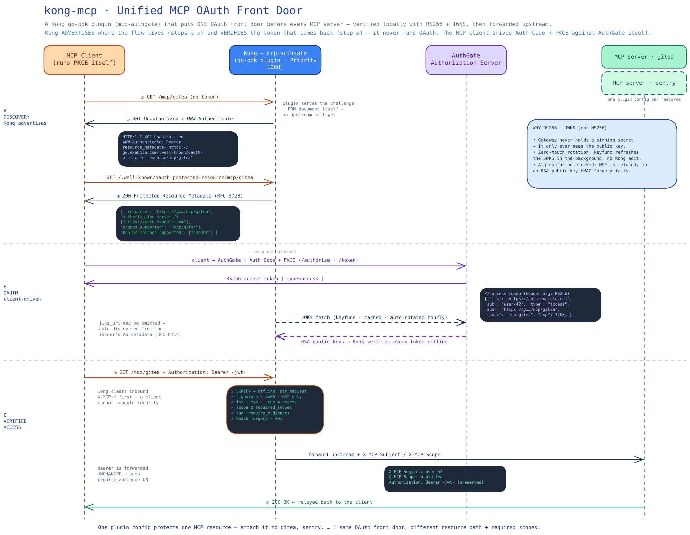
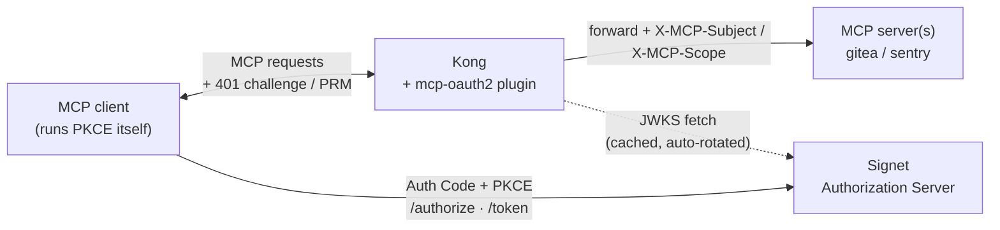
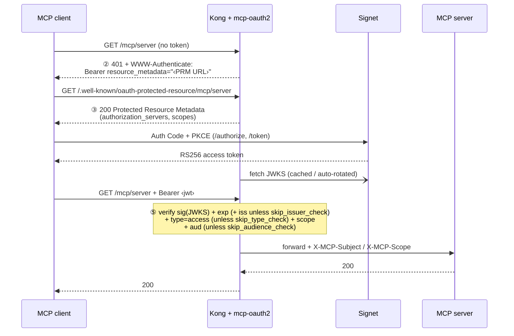

# kong-mcp-oauth2 — Unified MCP OAuth front door (Kong + Signet)

[](https://github.com/go-authgate/kong-mcp-oauth2/actions/workflows/docker.yml)
[](https://github.com/go-authgate/kong-mcp-oauth2/actions/workflows/security.yml)
[](https://goreportcard.com/report/github.com/go-authgate/kong-mcp-oauth2)
[](https://pkg.go.dev/github.com/go-authgate/kong-mcp-oauth2)
[](https://github.com/go-authgate/kong-mcp-oauth2/releases)
[](LICENSE)

> 繁體中文版本請見 [README.zh-TW.md](README.zh-TW.md)
>
> Hands-on macOS walkthrough against a real Signet: [HANDS-ON.zh-TW.md](HANDS-ON.zh-TW.md) (繁體中文)
>
> Expose the demo publicly over ngrok for remote MCP clients (MCP Inspector, claude.ai): [NGROK.zh-TW.md](NGROK.zh-TW.md) (繁體中文)

`mcp-oauth2` is a Kong [go-pdk](https://github.com/Kong/go-pdk) plugin — built
following Kong's [Develop Go plugins](https://developer.konghq.com/custom-plugins/go/)
guide — that puts **one OAuth front door in front of every MCP server**. Internal MCP services already sit
behind [Kong](https://github.com/Kong/kong); this plugin makes them stop
accepting hand-written PATs and instead require a [Signet](https://github.com/go-signet)-issued OAuth access
token — validated locally with **RS256 + JWKS**, then forwarded to the MCP
backend as trusted identity headers (by default the bearer token itself is
withheld from the backend).

## Architecture at a glance



The diagram above walks the whole handshake end to end: **A · Discovery** (Kong
advertises the flow — steps ② ③), **B · OAuth** (the client drives Auth Code +
PKCE against Signet while Kong fetches the JWKS), and **C · Verified access**
(Kong verifies the RS256 token offline at step ⑤, then forwards upstream with
`X-MCP-Subject` / `X-MCP-Scope`). Editable source:
[`architecture.excalidraw`](architecture.excalidraw) — open it at
[excalidraw.com](https://excalidraw.com) to tweak. The two Mermaid diagrams
below are the lightweight, GitHub-rendered version of the same flow.



**Kong does not run the OAuth flow.** It only _advertises where the flow is_
(steps ②③) and _verifies the token that comes back_ (step ⑤). The MCP client
runs Auth Code + PKCE against Signet by itself. One plugin config covers all MCP
servers — attach it to each service with a different `resource_path`.

## The handshake

This is the MCP authorization handshake (the 2025-06 MCP spec on top of RFC 9728
Protected Resource Metadata and RFC 6750 bearer tokens). The numbers map to the
`main.go` comments:



| Step | Who             | What happens                                                                                                                                                                                                                                            |
| ---- | --------------- | ------------------------------------------------------------------------------------------------------------------------------------------------------------------------------------------------------------------------------------------------------- |
| ②    | Kong → client   | Request with no/invalid token → `401` + `WWW-Authenticate: Bearer resource_metadata="<PRM URL>"`                                                                                                                                                        |
| ③    | Kong → client   | Client fetches `<PRM URL>` → plugin serves Protected Resource Metadata (which Signet, which scopes)                                                                                                                                                     |
| —    | client ↔ Signet | Client discovers Signet from the metadata and runs **Auth Code + PKCE** to get an access token                                                                                                                                                          |
| ⑤    | Kong            | Client retries with `Authorization: Bearer <jwt>` → plugin verifies **sig (JWKS) + exp** (+ **iss** unless `skip_issuer_check`) (+ **`type=access`** unless `skip_type_check`) **+ scope** (+ **aud** unless `skip_audience_check`) → forwards upstream |

## Why RS256 + JWKS (not HS256)

- **No shared secret on the gateway.** With HS256 the gateway would have to hold
  Signet's signing secret — putting a forge-anything key on the edge. With
  RS256 + JWKS, Kong only ever sees the **public** key.
- **Zero-touch key rotation.** Rotate keys in Signet's JWKS; Kong picks them up
  automatically (keyfunc background refresh). No Kong config change.
- **Alg-confusion is blocked.** The plugin pins accepted algorithms to
  `RS256/RS384/RS512` and refuses `HS*`. This defeats the classic
  forgery where an attacker signs HS256 using the RSA _public_ key as the HMAC
  secret. (Validation matrix row 5, last item, tests exactly this.)

The verification engine is [`MicahParks/keyfunc`](https://github.com/MicahParks/keyfunc),
which handles JWKS fetch, in-memory cache, background rotation, and rate-limited
refetch on an unknown `kid` — the parts that are easy to get wrong by hand in Lua.

## Configuration reference

One plugin instance per MCP resource. See `kong.yml` for full examples.

| Field                    | Required | Description                                                                                                                                                                                                                                                                                                                                                                                                                                                                                                                                                                                                                                                       |
| ------------------------ | -------- | ----------------------------------------------------------------------------------------------------------------------------------------------------------------------------------------------------------------------------------------------------------------------------------------------------------------------------------------------------------------------------------------------------------------------------------------------------------------------------------------------------------------------------------------------------------------------------------------------------------------------------------------------------------------- |
| `issuer`                 | ✅       | Signet base URL. Must equal the token's `iss` claim byte-for-byte (unless `skip_issuer_check` is set).                                                                                                                                                                                                                                                                                                                                                                                                                                                                                                                                                            |
| `gateway_origin`         | ✅       | Externally reachable Kong origin, e.g. `https://gw.example.com`. Used to build the PRM URL.                                                                                                                                                                                                                                                                                                                                                                                                                                                                                                                                                                       |
| `resource_path`          | ✅       | This resource's path, e.g. `/mcp/server`.                                                                                                                                                                                                                                                                                                                                                                                                                                                                                                                                                                                                                         |
| `jwks_uri`               |          | Signet JWKS endpoint (RS256). Accepted algs are always pinned to the RS family. Leave empty to **auto-discover** it from the issuer's AS metadata (RFC 8414 `/.well-known/oauth-authorization-server`, falling back to OIDC discovery; cached 1h, the metadata's `issuer` must match). Set it explicitly when Kong reaches Signet on a different host than clients do — e.g. `host.docker.internal` in the compose demos.                                                                                                                                                                                                                                         |
| `required_scopes`        |          | All listed scopes must be present in the token's `scope`, else `403 insufficient_scope`.                                                                                                                                                                                                                                                                                                                                                                                                                                                                                                                                                                          |
| `audience`               |          | Expected `aud` for **token validation only**. Defaults to `gateway_origin + resource_path`. The PRM `resource` always stays the canonical URL (RFC 9728 §3.3), so set this only when Signet emits a fixed non-URL `aud`.                                                                                                                                                                                                                                                                                                                                                                                                                                          |
| `leeway_seconds`         |          | Clock-skew tolerance for `exp`/`nbf`. Recommend `60`. Must be ≥ 0.                                                                                                                                                                                                                                                                                                                                                                                                                                                                                                                                                                                                |
| `upstream_auth_mode`     |          | What the backend receives in place of the client's bearer token. **Default `strip`**: the `Authorization` header is removed after validation — identity travels only in the trusted `X-MCP-*` headers, so the backend never holds a live, replayable user credential. `passthrough` forwards the client token unchanged (pre-0.6 behavior; use when the backend validates the token itself, e.g. the Gitea demo route). `static` removes the client token and sends a fixed upstream credential instead.                                                                                                                                                          |
| `upstream_auth_token`    |          | Required when `upstream_auth_mode: static` (a missing one fails every request with `500 server_error` + a critical log — never a silent fallback to another mode). The upstream credential to send. Keep it out of committed declarative configs with Kong's `${{ env "KONG_UPSTREAM_TOKEN" }}` substitution.                                                                                                                                                                                                                                                                                                                                                     |
| `upstream_auth_header`   |          | `static` mode only. Header that carries the upstream credential; default `Authorization`, which gets a `Bearer ` prefix. A custom name (e.g. `X-Api-Key`) receives the token verbatim, no prefix — and the client's `Authorization` header is **still removed**.                                                                                                                                                                                                                                                                                                                                                                                                  |
| `upstream_extra_headers` |          | List of `"Name: value"` strings set on every upstream request in **all** modes (tenancy/source tags). Split at the first colon only, so values may contain colons (URLs). Reserved names are rejected at validation: `Authorization`, anything `X-MCP-*`, and the `upstream_auth_header` in use.                                                                                                                                                                                                                                                                                                                                                                  |
| `skip_issuer_check`      |          | ⚠️ Default `false`. When `true`, the token's `iss` claim is **not** validated against `issuer`. The `issuer` field is still required (it is used for AS metadata discovery and the PRM response). Use only when the token issuer is known to omit the `iss` claim.                                                                                                                                                                                                                                                                                                                                                                                                |
| `skip_type_check`        |          | ⚠️ Default `false`. When `true`, the `type=access` guard is skipped — refresh tokens and tokens without a `type` claim are accepted as bearer credentials. Use only when the authorization server does not set a `type` claim.                                                                                                                                                                                                                                                                                                                                                                                                                                    |
| `skip_control_chars`     |          | ⚠️ Default `false`. When `true`, the CR/LF injection guard on forwarded claims (`X-MCP-*` headers) is disabled. Use only temporarily while debugging with non-standard tokens. The `upstream_auth_*` **config** values are validated unconditionally — this toggle never relaxes them (a control char in config is always a typo or an injection, never a debug scenario).                                                                                                                                                                                                                                                                                        |
| `skip_audience_check`    |          | ⚠️ Default `false`: `aud` is **enforced by default** (RFC 8707 / MCP spec — the resource server MUST verify the token was issued for it). Signet emits a per-resource `aud`: the client sends `resource=<gateway_origin + resource_path>` on the token request, and that URL must be on the client's `allowed_resources` allowlist. The expected value is an exact, scheme/slash-sensitive match — a token minted without a matching `aud` (or with no `aud` at all) gets `401`. Set `true` only when the token issuer cannot emit a per-resource `aud` (e.g. the Gitea demo route) or temporarily while debugging token issuance (see the replay warning below). |
| `debug_claims`           |          | ⚠️ Default `false`. When `true`, dumps the full decoded claim set to Kong's debug log for every request the plugin decodes — an operator aid for finding which claim carries the scope/`aud`/`type` behind an unexpected `401`/`403`. Gated by config, **not** by log level alone (`kong.Log.Debug` ships to Kong on every call regardless of `log_level`), so it stays off until you opt in. Enable it together with `KONG_LOG_LEVEL=debug` to actually see the output. Claims may contain PII, so turn it on deliberately and briefly.                                                                                                                          |

Only tokens with `type=access` are accepted; Signet refresh tokens (same key,
`iss`, `aud`, and `scope`, differing only by `type` and a longer `exp`) are
rejected with `401 invalid_token`. Set `skip_type_check: true` only when the
authorization server is known not to emit a `type` claim.

> go-pdk schemas can't mark fields required, so the three required fields are
> validated on the first request instead — a missing one fails every request
> with `500 server_error` and a critical log line, not a silent misbehavior.
>
> **Routing gotcha.** Each Kong route must match **both** `resource_path` and its
> PRM path (`/.well-known/oauth-protected-resource` + `resource_path`). Otherwise Kong has no route to
> hand the client's step ③ lookup to and the plugin never serves the metadata.
> See the `paths:` lists in `kong.yml`.
>
> **Cross-resource replay warning (if you set `skip_audience_check: true`).**
> With the check skipped, `aud` is **not** validated, so the only thing
> distinguishing one MCP resource from another is `scope`. A token minted with
> multiple scopes (e.g. `mcp:gitea mcp:sentry`) is accepted at **every**
> resource whose scope it carries, and because the raw bearer is forwarded
> upstream unchanged, a backend that receives it can replay it against a
> sibling resource. This is why the check is on by default; if you skip it to
> debug token issuance, remove the flag before treating resources as isolated.
>
> **Migrating from ≤ 0.4.x (`require_audience` removed).** `aud` enforcement is
> now the default, and the old opt-in field is gone: a declarative config that
> still contains `require_audience` is **rejected by Kong's schema validation at
> load time** (a deliberate loud failure, not a silent behavior change).
>
> - `require_audience: true` → delete the line (the default now covers it).
> - `require_audience: false` → replace with `skip_audience_check: true` —
>   but first check whether your tokens can simply be minted with the right
>   `aud` (RFC 8707 `resource` parameter, see the preflight section below).
>
> If tokens without a matching `aud` start getting `401` after the upgrade, the
> `rejected token` line in Kong's log names the audience mismatch, and
> `skip_audience_check: true` is the temporary escape hatch.
>
> **Migrating from ≤ 0.5.x (`Authorization` no longer forwarded by default).**
> The client's bearer token is now **stripped** before the request reaches the
> backend (`upstream_auth_mode` defaults to `strip`) — a breaking change chosen
> deliberately over a silent unsafe default, same reasoning as the
> `require_audience` migration above. If your backend authenticates the
> forwarded token itself, restore the old behavior with one line:
>
> ```yaml
> upstream_auth_mode: "passthrough"
> ```
>
> The safe upgrade order: first make the backend trust the `X-MCP-*` identity
> headers (and restrict it to accept traffic only from Kong — see Operational
> notes), then remove the `passthrough` line.

## 1. Build the plugin

go-pdk plugins are ordinary executables that speak the pluginserver RPC protocol
— no cgo, no `.so`. A full `go build` needs network access for the go-pdk
protobuf transitive deps; run it from the repo root:

```bash
go mod tidy && go build -o mcp-oauth2 .
```

## 2. Wire it into Kong

Register the plugin and point the pluginserver at the binary (env vars, shown in
`docker-compose.yml`):

```bash
KONG_PLUGINS=bundled,mcp-oauth2
KONG_PLUGINSERVER_NAMES=mcp-oauth2
KONG_PLUGINSERVER_MCP_OAUTH2_START_CMD=/usr/local/bin/mcp-oauth2
KONG_PLUGINSERVER_MCP_OAUTH2_QUERY_CMD=/usr/local/bin/mcp-oauth2 -dump
```

## 3. Run the demo stack

```bash
docker compose up --build
```

This starts DB-less Kong (proxy on `:8000`; the unauthenticated admin API is
bound to container-loopback and not published — see `docker-compose.yml`) with
two stub MCP upstreams. Edit `kong.yml` so `issuer` / `gateway_origin` /
`jwks_uri` point at your real Signet before expecting tokens to validate.

## 4. Validation matrix

After `docker compose up`, exercise the handshake. Replace `$GW` with
`http://localhost:8000` for the demo (or your `gateway_origin`).

> Rows 1–2 work against the stub demo as shipped. Rows 3–5b need real tokens:
> point `issuer` / `jwks_uri` in `kong.yml` at a Signet first (with the
> placeholder config they fail with `503 temporarily_unavailable`, since
> `auth.example.com` has no JWKS to fetch). Because `aud` is enforced by
> default, the tokens for rows 3–5a must be bound to the resource — request them
> with `resource=<gateway_origin + resource_path>` (RFC 8707). Row 5c is the exception — an HS256
> forgery is rejected with `401 invalid_token` _before_ any JWKS fetch (the alg
> is pinned first), so it returns `401` even against the placeholder config.

| #   | Test                         | Command                                                                                  | Expect                                                                       |
| --- | ---------------------------- | ---------------------------------------------------------------------------------------- | ---------------------------------------------------------------------------- |
| 1   | Unauthenticated → challenge  | `curl -i $GW/mcp/server`                                                                 | `401` + `WWW-Authenticate: Bearer resource_metadata="…"`                     |
| 2   | PRM document served          | `curl -s $GW/.well-known/oauth-protected-resource/mcp/server`                            | JSON with `resource`, `authorization_servers`, `scopes_supported`            |
| 3   | Valid token → forwarded      | `curl -i $GW/mcp/server -H "Authorization: Bearer $GOOD"`                                | `200` from the MCP upstream                                                  |
| 4   | Expired token                | `curl -i $GW/mcp/server -H "Authorization: Bearer $EXPIRED"`                             | `401 invalid_token`                                                          |
| 5a  | Missing scope                | token without `required_scopes` → `curl -i $GW/mcp/server -H "Authorization: Bearer $X"` | `403 insufficient_scope`                                                     |
| 5b  | **Cross-audience**           | token issued for a different resource (aud enforced by default)                          | `401 invalid_token` (aud mismatch)                                           |
| 5c  | **HS256 forgery (key bits)** | forge an HS256 token using the RSA public key as the HMAC secret                         | `401 invalid_token` — **must be rejected** (alg confusion)                   |
| 6a  | **Token withheld upstream**  | valid token, default `strip` mode → call the demo `whoami` tool                          | `token_forwarded: false` — no `Authorization` reached the backend            |
| 6b  | **`X-MCP-*` spoofing**       | valid token (sub=alice) + client-sent `X-MCP-Subject: admin` and `X-MCP-Foo: x`          | backend sees `subject: alice` (one value, from the token) and no `X-MCP-Foo` |

Rows **5b**, **5c**, and **6b** are the security-critical ones — run them
before going live. Row 6b uses the same `whoami` call as 6a: inject the spoofed
headers on the client side and confirm the echoed identity comes from the
token, not the client.

## Signet-side preflight

Before this works end-to-end, confirm three things on Signet (decode a real
**access token**, not just the `id_token`):

1. **JWKS resolves.** `GET <issuer>/.well-known/openid-configuration` → its
   `jwks_uri` returns a non-empty `keys` array.
2. **Access tokens are RS256.** Decode an actual access token; its header `alg`
   is `RS256` (not `HS256`) and its `kid` matches a key in the JWKS. Signet's
   default is often `JWT_SECRET` (HS256) — make sure you've moved **access
   tokens** (not only `id_token`) to asymmetric signing.
3. **Issuer matches.** The token's `iss` equals the plugin's `issuer` config,
   byte-for-byte (mind the trailing slash).
4. **`aud` binds to the resource.** `aud` is enforced by default, so every
   token must be requested with RFC 8707 resource binding: add
   `<gateway_origin + resource_path>` (e.g. `https://gw.example.com/mcp/server`)
   to the OAuth client's `allowed_resources` in Signet (an empty allowlist is
   deny-all and the token endpoint answers `invalid_target`), then send
   `resource=<that URL>` on the token request. Decode the token and confirm
   `aud` equals the plugin's expected value exactly.

## Operational notes

- **Set `KONG_LOG_LEVEL: "info"` to see 401 diagnostics.** The plugin logs rejection reasons (`rejected token`, `non-access token`, `control chars`) at Kong's `info` level via `kong.Log.Info`. Kong's default log level is `notice`, which is higher than `info`, so these messages are invisible unless you lower it. Both shipped compose files already set `KONG_LOG_LEVEL: "info"`. Filter with:

  ```bash
  docker compose logs -f kong | grep -E "rejected token|non-access token|control chars|JWKS|plugin misconfigured"
  ```

- **Auto-discovery adds the metadata endpoint to the availability chain.** With
  `jwks_uri` empty, the first token (and one refresh per hour) also depends on
  the issuer's AS metadata endpoint; a cold-cache discovery failure is answered
  `503` and retried on the next request, while a failed hourly refresh keeps
  serving the last discovered `jwks_uri`.
- **JWKS endpoint must be highly available.** If the **initial** fetch fails,
  token requests get `503 temporarily_unavailable` (not `401`, so clients don't
  re-run OAuth) and it is retried on the next request — a failed initial fetch is
  never cached. Fetch waits are capped at 10s and run under a per-URI lock, so a
  slow Signet can't stall traffic for other resources. Caveat: once keys are
  cached, a token whose `kid` is unknown returns `401 invalid_token` (offline
  validation can't tell "key rotated in mid-outage" from "forged kid"), and an
  hourly refresh that pulls a JWKS containing one malformed key can drop the
  cached keys until a clean refresh. Keep the JWKS valid and overlap keys
  generously during rotation.
- **Browser-based MCP clients need CORS.** A CORS preflight (`OPTIONS`, no
  `Authorization`) is answered with the `401` challenge; put Kong's `cors`
  plugin on the route if web-hosted clients must reach the gateway.
- **Overlap keys during rotation.** Keep the old and new keys in the JWKS
  together for a window so in-flight tokens aren't killed mid-rotation.
- **Keep access-token TTLs short.** Like any offline validation, a revoked token
  stays valid until its `exp` — minutes, not hours.
- **The bearer token is withheld from the backend by default.** After
  validation, Kong sets the trusted `X-MCP-*` identity headers (`Subject` /
  `Scope` / `Issuer` / `Audience` / `Client` / `Token-Id` / `Expires`), clears
  any other client-sent `X-MCP-*` name, and — under the default
  `upstream_auth_mode: strip` — removes the `Authorization` header, so the
  backend never holds a live, replayable user credential. The plugin logs the
  active mode once at `info` level (`upstream auth mode: …`). Two consequences:
  - **`passthrough` restores the old exposure.** With it, each MCP backend
    receives a live token it can replay against the _same_ resource until
    `exp`; leave the default `aud` enforcement on (don't set
    `skip_audience_check`) so it at least can't cross to a sibling resource.
  - **In `strip`/`static` mode, `X-MCP-*` is the backend's only identity
    source — so the backend MUST accept traffic exclusively from Kong**
    (network policy / mTLS / private network). Any path around the gateway
    lets a caller write its own `X-MCP-Subject`. This was always the deployment
    contract; without the token as a second factor it is now load-bearing.
